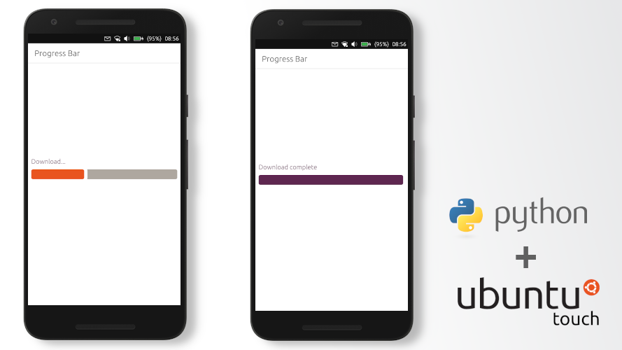

# Interacting with QML Interface via Python on Ubuntu Touch
[[статья на русском]](http://dtc1.ru/Взаимодействуем%20с%20QML%20интерфейсом%20через%20Python%20на%20Ubuntu%20Touch)

**Let's create a new project in Clickable**, enter the command in the terminal:
    
    clickable create
	
Select the Python project type and fill in:  
Title \[App Title\]: Progress Bar  
App Name \[appname\]: exemple-progress-bar

Find Main.qml in the project folder and delete all unnecessary things - Python object, Label in Page.

Now let's create an interface:

    Text {
        id: label1
        text: qsTr("Download...")
        color: "#5E2750"
        anchors{
            verticalCenterOffset: -units.gu(4)
            verticalCenter: parent.verticalCenter
            left: parent.left
            leftMargin: units.gu(1)
            right: parent.right
        }
        font.pixelSize: units.gu(2)
        }
    
    Rectangle {
        height: units.gu(5)
        color: "white"
        anchors
        {
        verticalCenter: parent.verticalCenter
        right: parent.right
        left: parent.left
        }
        Rectangle {
            color: "#AEA79F"
            anchors.fill: parent
            border.width: units.gu(1)
            radius: units.gu(1.5)
            border.color: "white"
        }    
        Rectangle {
            id: progressbar1
            color: "#E95420"
            property real value: 0
            anchors{
                rightMargin: parent.width/100*(100-value)
                fill: parent
            }
            border.width: units.gu(1)
            radius: units.gu(1.5)
            border.color: "white"
        }
    }
	
Thus, we have created a Label to display the status of the process and custom progress bar.
The progress bar is two rectangles \ - the state bar and its background. In order to be able to interact with it, assign **id: progressbar1**. We also add a variable for the **value** interaction. Depending on the value of this variable, the right margin from the edge will change, according to the formula \- parent.width / 100 * (100-value).

Now let's add a Python object:

    Python {
        id: python1

        Component.onCompleted: {
        addImportPath(Qt.resolvedUrl('../src/'));
        setHandler('progress', function(ratio) {
            progressbar1.value = ratio;
        });
        setHandler('finished', function() {
            label1.text = qsTr("Download complete");
            progressbar1.color = "#5E2750";
        });

        importModule('example', function () {
           startDownload();
        });
        }
        function startDownload() {
            progressbar1.value = 0.0;
            call('example.downloader.download', function() {});
        }

        onError: {
            console.log('python error: ' + traceback);
        }
    }
	
We have created 2 events for interaction - **progress** and **finished**. When we pass the variable to progress, the progressbar1.value will change. And when we are finished, through the call finished, we will display the message "Download complete" and change the color of the progress bar to purple.

To start the download, we created the **startDownload ()** function. It can be called anywhere in the code via **python1.startDownload ()** (*For example, when the button is pressed*). In this code, this function is called when the example script is initialized.

Now go to the src folder and edit example.py:

    import pyotherside
    import time
    import threading

    def slow_function():
        for i in range(100):
            pyotherside.send('progress', i)
            time.sleep(0.2)
        pyotherside.send('finished')

    class Downloader:
        def __init__(self):
            self.bgthread = threading.Thread()

        def download(self):
            if self.bgthread.is_alive():
                return
            self.bgthread = threading.Thread(target=slow_function)
            self.bgthread.start()

    downloader = Downloader()
	
This example creates a new class **Downloader**. Upon initialization, it will create a new object for the thread, which will interact with the progress bar. This process can be started manually or re-run via the download function.

To ensure that **one process** always interacts with the progress bar, we write a check **if self.bgthread.is_alive ()**. If the process is already running, it will not create a new thread.

Now we can create this object **downloader = Downloader ()**

In the **slow_function ()** stream, we interact with QML through the **pyotherside.send ()** function. First, we send the values to **progress** (0-100), and then we call the **finished** event.

All that remains is to run the code.

